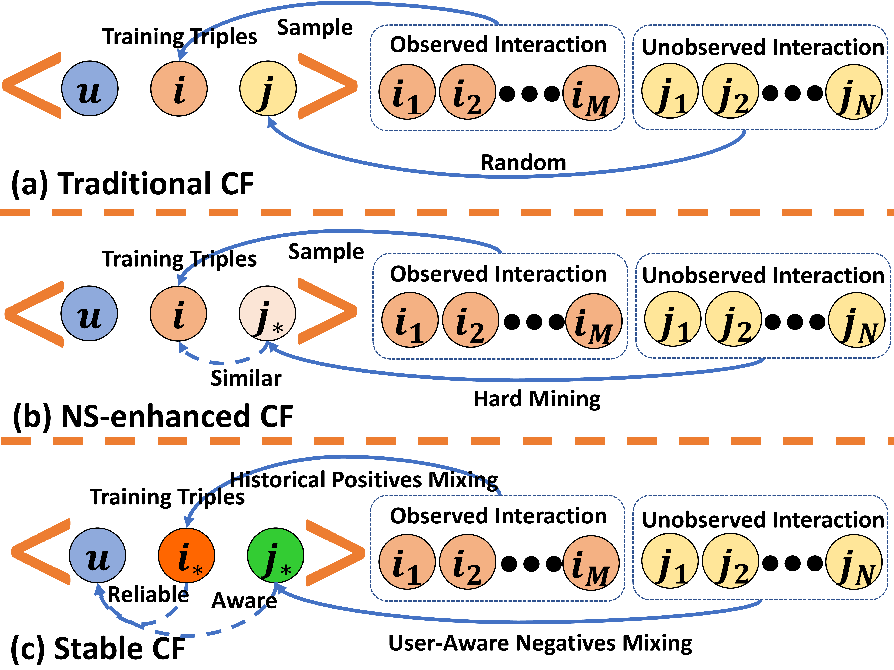
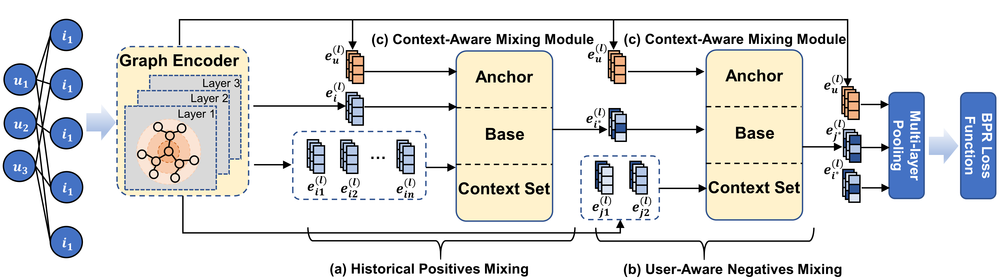

# StabCF: A Stabilized Training Method for Collaborative Filtering

[](https://link-to-your-paper.pdf)

This repository provides the **PyTorch implementation** for our paper:

> **StabCF: A Stabilized Training Method for Collaborative Filtering**  
> Xi Wu, Wenzhe Zhang, Liangwei Yang, Yi Zhao, Jiquan Peng, Jibing Gong  
> Accepted at *The 32nd ACM SIGKDD Conference on Knowledge Discovery and Data Mining (KDD 2026)*

---

## 📌 Introduction
Collaborative Filtering (CF) models trained on implicit feedback are commonly optimized using sampling-based paradigms, most notably Bayesian Personalized Ranking (BPR).  
While such approaches have achieved strong empirical performance, **their training stability has received little attention**.
### 🧩 Training Paradigm Comparison

<p align="center">
  
</p>

In this work, we identify **two fundamental sources of training instability** in collaborative filtering:

- **1. Unreliable positive samples**: A single observed interaction may not reliably reflect true user preference due to noise, sparsity, or accidental behaviors in implicit feedback.

- **2. Inconsistent negative samples**: Negatives sampled from the vast unobserved space exhibit highly fluctuating hardness, leading to unstable and noisy gradient updates across training iterations.

These two issues jointly cause unstable optimization dynamics, hindering convergence and resulting in fluctuating and suboptimal recommendation performance.

### 🧠 StabCF Framework Overview
<p align="center">
  
</p>

To address this problem, we propose **StabCF**, a **stabilized training framework** for collaborative filtering.  
Instead of directly optimizing on raw training triplets \(u, i, j\), StabCF synthesizes **context-aware positive–negative pairs** by jointly enhancing positive reliability and negative consistency.  
This design smooths the training dynamics and leads to more stable and effective model optimization.


---

## 🚀 Key Features

- **Stability-Oriented Training Framework**  
  StabCF explicitly targets training instability in CF by stabilizing both positive and negative samples.

- **Context-Aware Sample Synthesis**  
  Raw training triplets are replaced with synthesized \(u, i^\*, j^\*\) pairs, improving optimization dynamics.

- **Model-Agnostic and Plug-and-Play**  
  Easily integrates with popular CF backbones such as LightGCN, NGCF, and ApeGNN.

- **Consistent Performance and Stability Gains**  
  Achieves superior accuracy and significantly smoother convergence across multiple datasets and backbones.

---

## ⚙️ Environment Requirements

The code has been tested with **Python 3.8.0** and **PyTorch 2.0.0**.  

Install dependencies with:

```bash
pip install -r requirements.txt
```

### Required Packages
- `torch==2.0.0`
- `numpy==1.22.4`
- `scipy==1.10.1`
- `scikit-learn==1.1.3`
- `prettytable==2.1.0`


## 🏃‍♂️ Training

All command-line arguments are defined in [`utils/parser.py`](utils/parser.py).  
Below are the **key arguments** when using **StabCF**:

```bash
- `alpha`
  - It controls the relative importance of the current positive instance when mixing with user historical interactions and negative samples.
- `N`(`window_length` used in code)
  - It specifies the number of historical positives used for generating the positive samples.
- `M`(`n_negs` used in code)
  - It specifies the size of negative candidate set when using StabCF.
```


### ▶️Examples: 
#### 🧪ApeGNN + StabCF
```Python
python main.py --dataset ali --gnn ApeGNN_HT --lr 0.001 --l2 0.001 --pool sum --ns stabcf --n_negs 16 --alpha 24 --window_length 10 

python main.py --dataset yelp2018 --gnn ApeGNN_HT --lr 0.001 --l2 0.001 --pool sum --ns stabcf --n_negs 16 --alpha 23 --window_length 10 

python main.py --dataset amazon --gnn ApeGNN_HT --lr 0.001 --l2 0.001 --pool sum --ns stabcf --n_negs 16 --alpha 58 --window_length 10 
```
#### 🧪LightGCN_StabCF

```Python
python main.py --dataset ali --lr 0.001 --l2 0.001 --ns stabcf --alpha 21 --n_negs 32 --window_length 10

python main.py --dataset yelp2018 --lr 0.001 --l2 0.001 --ns stabcf --alpha 20 --n_negs 64 --window_length 5

python main.py --dataset amazon --lr 0.001 --l2 0.001 --ns stabcf --alpha 21 --n_negs 64 --window_length 5
```

#### 🧪NGCF_StabCF
```Python
python main.py --dataset ali --gnn ngcf --batch_size 1024 --lr 0.0001 --l2 0.0001 --pool concat --ns stabcf --n_negs 32 --alpha 1 --window_length 5 

python main.py --dataset yelp2018 --gnn ngcf -batch_size 1024 --lr 0.0001 --l2 0.0001 --pool concat --ns stabcf --n_negs 64 --alpha 9 --window_length 5 

python main.py --dataset amazon --gnn ngcf -batch_size 1024 --lr 0.0001 --l2 0.0001 --pool concat --ns stabcf --n_negs 32 --alpha 30 --window_length 5 
```


## 📝 Citation
If you find this repository useful, please cite our paper:

```bibtex
@inproceedings{wu2026stabcf,
author = {Wu, Xi and Zhang, Wenzhe and Yang, Liangwei and Zhao, Yi and Peng, Jiquan and Gong, Jibing},
title = {StabCF: A Stabilized Training Method for Collaborative Filtering},
year = {2026},
booktitle = {Proceedings of the 32nd ACM SIGKDD Conference on Knowledge Discovery and Data Mining V.1},
}
```


